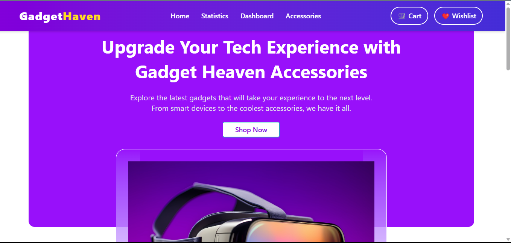
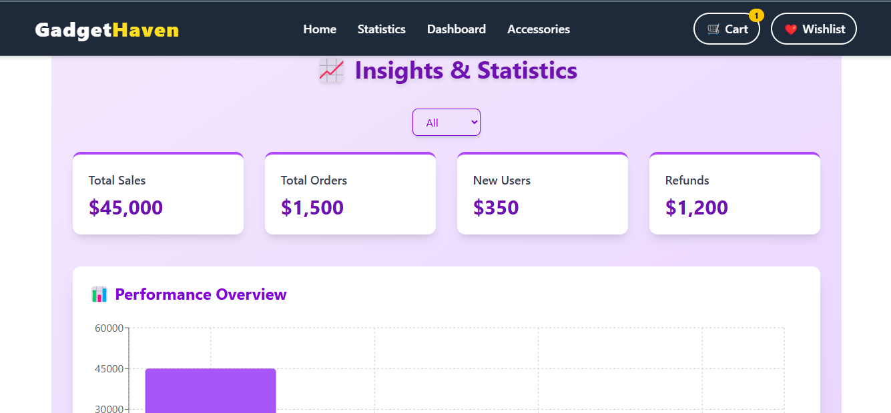
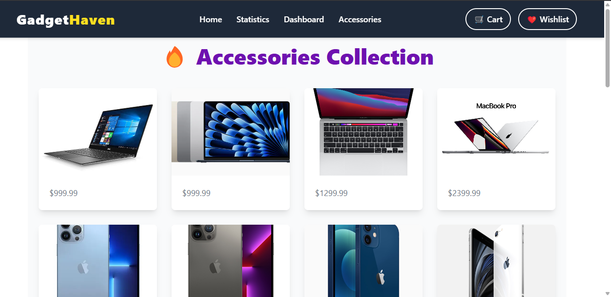
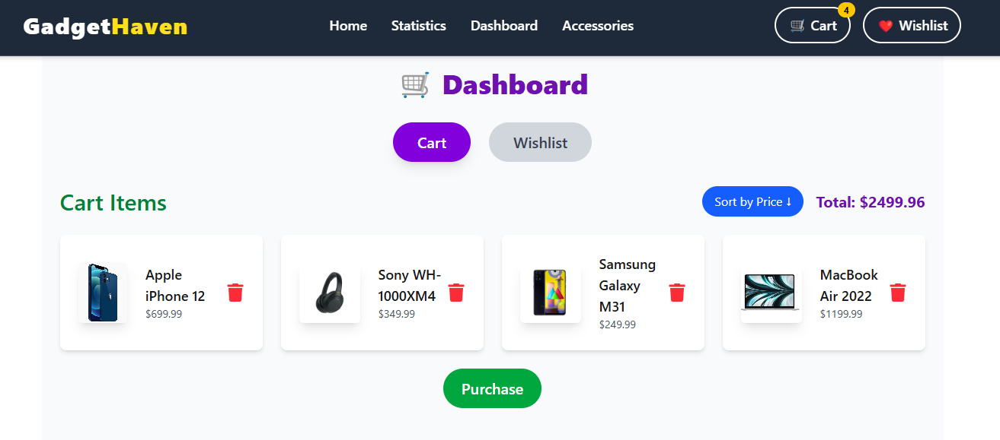

# 🚀 Gadget Haven

A beautifully crafted e-commerce web application where users can explore gadgets, add them to cart or Wishlist, and experience a smooth and dynamic user interface.

🔗 **Live Site:** [Gadget Haven](https://calm-druid-026b5d.netlify.app/)

---

## 🖼️ Preview

> Here are some screenshots of the Gadget Haven app:

---

## ✨ Features

- 🏠 Home page with featured gadgets
- 📊 Fancy statistics page with chart animations
- 💼 Dashboard with cart and Wishlist management
- 🎧 Accessories page with stylish UI
- ❤️ Add to Wishlist and 🛒 Add to Cart functionality with counter badge
- 🔍 Search and filtering functionality by category
- 📱 Fully responsive (mobile-first design)
- 🎉 React Toastify notifications for all actions
- 🔒 Smooth routing with React Router

---

## ⚙️ Tech Stack

- **React** (with Hooks & Context API)
- **React Router DOM**
- **Tailwind CSS**
- **React Toastify**
- **Chart.js / Recharts**
- **Netlify** (for deployment)

---

